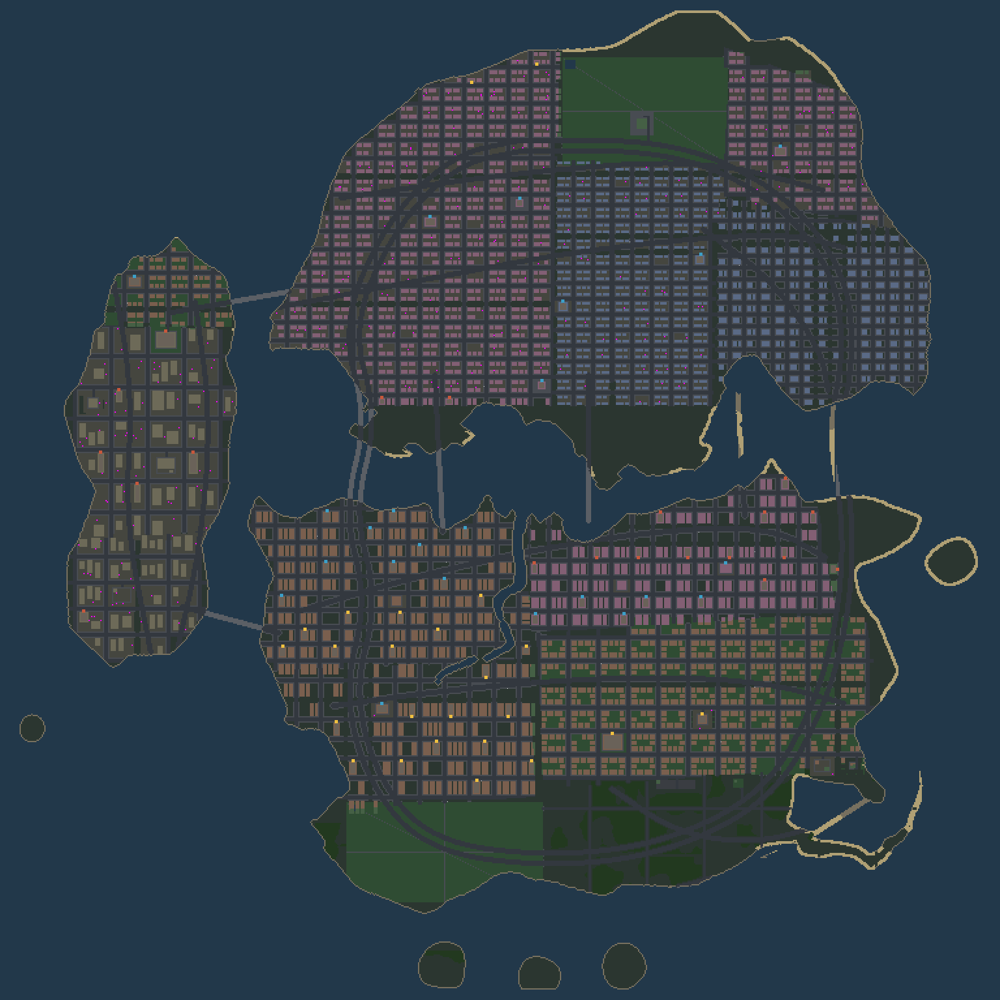

# topdown-city

Browser-based, real-time multiplayer, top-down open-city sandbox — original
work in the genre of early top-down open-city action games. TypeScript
throughout; deterministic 30 Hz simulation shared between an authoritative
Node server and a browser client that renders the world with three.js
(`?render=2d` falls back to the original Canvas-2D renderer).

## Run it

```bash
pnpm install
pnpm build          # tsc -b (shared + server)
node server/dist/index.js          # terminal 1 — server on ws://127.0.0.1:8080
pnpm --filter client dev           # terminal 2 — Vite on http://localhost:5173
```

Open http://localhost:5173 in as many tabs as you like (4–8 players). The game
fills the browser window: the world view grows with it, at a zoom that keeps
the art on whole pixels.

| Query parameter | Effect |
| --- | --- |
| `?local=1` | **no server**: run the whole game in a Web Worker in this tab. `?seed=`, `?peds=`, `?interest=`, `?proving=1`, `?difficulty=` are the offline equivalents of the server's environment variables |
| `?server=ws://host:port` | connect elsewhere (default `ws://<hostname>:8080`) |
| `?night=0..1` | force the hour, 0 midday to 1 midnight. A day is 24 minutes long, so this is the only practical way to look at the night lighting |
| `?lights=cheap` | keep the grade and the lamps, drop the shadow casting and the bloom |
| `?lights=off` | no lighting pass at all |
| `?render=2d` | draw the world with the original Canvas 2D renderer. **3D is the default**; only the world layer differs — HUD, minimap, overlay, input and client-side prediction are shared. Keep this if WebGL is unavailable or slow |
| `?extrude=1` | true parallax building extrusion — roofs displaced away from the screen centre in proportion to height, drawn per frame instead of baked (SHIP.md U2). Off by default while the flat-centre problem is open |

### Controls

| Input | Action |
| --- | --- |
| WASD / arrows | walk (screen-relative: up goes up), drive (up=throttle, down=brake/reverse, left/right=steer) |
| Mouse | aim; click or Space to fire, on foot or out of a car window |
| E / Enter | enter/exit car, context action |
| F | use the car's fitting: fire the guns, drop a mine or slick, arm the bomb |
| Shift | in an aircraft: take off, and land again. The throttle is airspeed; this is altitude. A helicopter lifts from wherever it is standing, a plane needs speed on a runway — the HUD says which it is waiting for |
| 1–8 | switch weapon slot |
| Y U I O H J N P | buy items while inside a shop (or in its doorway) — guns, clothes, resprays, car fittings, hospital treatment |
| R / G | answer a ringing payphone / walk away from the job |
| M | mute / unmute sound |
| L / K | log in / register (optional — guests always play) |
| ` (backquote) | debug overlay: tick, RTT, bandwidth, hitboxes (including the oriented box a car really collides with), prediction ghost |

### Server environment variables

| Var | Default | Meaning |
| --- | --- | --- |
| `PORT`, `HOST` | `8080`, `127.0.0.1` | WebSocket bind |
| `SEED` | random | session seed. **Not** a city seed: there is one city and it is the same one every time (see *The city*, below). What the seed moves is the furniture — which kerbs are parked up, where the crates and hidden packages are, which gang holds what |
| `WEAPONS_LOST_ON_DEATH` | `true` | death costs your guns (design flag) |
| `PED_COUNT` | `200` | pedestrians per session |
| `INTEREST_RADIUS` | `600` | px; entities beyond it aren't sent |
| `MAX_CONNECTIONS` | `128` | sockets at once, joined or not |
| `MAX_PLAYERS` | `32` | players in the session at once; reconnects are exempt |
| `PERSIST_PATH` | `data/persist.db` | SQLite (node:sqlite); `.json` = file store |
| `DIFFICULTY` | `normal` | police preset: `relaxed`, `normal` or `hard` (`police.json` → `presets`). Server-side: in a shared city a per-player difficulty is a cheat |
| `PROVING_GROUND` | unset | `1` adds a debug room by the spawn that hands out vehicles and kit for nothing. **Free-cars room — off unless you ask** |
| `REPLAY` / `REPLAY_DIR` | on / `replays` | input recording (`REPLAY=0` off) |

### Testing a physics change

```bash
PROVING_GROUND=1 node server/dist/index.js
```

You spawn on the doorstep of a proving ground: walk in and the shop keys
(`Y U I O H J N P`) hand over a tank, a car, six cars laid out in a row to
drive down, a bus, a truck, every weapon, full health, and $10,000 — free, and
with no ledger, standings or district in the way. Green on the minimap.

Turning it on changes nothing about the city: the same streets, buildings,
parked cars, props and pickups with the room and without it, so a bug you find
with it open is still there when you close it. The one thing it does change is
where you start, which is the point. Everything it
hands out arrives as an ordinary `SimCommand`, so the session still records and
replays like any other.

`node:sqlite` needs Node 22.5+ (22.5–22.12 also need `--experimental-sqlite`)
from a build compiled with SQLite support. Where it is missing — the runtime
reports `Unknown builtin module: node:sqlite` — the server no longer fails to
start: it prints a warning and persists to the sibling `.json` file via the
file store instead. Set `PERSIST_PATH=data/persist.json` to choose that
deliberately and silence the warning.

Every kind of vehicle can be found somewhere: an ambulance at a hospital, a
digger at the quarry, a pickup at the farm, the tank behind a police station.
Those homes are marked on the minimap, and there is a test that walks the
whole roster rather than spot-checking it.

## The city

There is one city and it was drawn, not rolled: **Anywhere City**, 384×384
tiles (6144×6144 px) of island group — three boroughs joined by four bridges,
with the sea all the way round as the map's edge.

| Borough | What it is |
| --- | --- |
| **Port Vasco** (north-west) | The working waterfront. Huge industrial lots, few streets, a harbour biting into its east shore, the power station and the quarry. |
| **Ravenhill** (north-east) | Downtown. A tight grid, long avenues north–south and short streets east–west, a park in the middle of it, the tower on First Avenue. |
| **Sunridge** (south) | The mainland. Commercial along the waterfront, suburbs behind it, the stadium, then open country, the airfield, the farm and the beach at the bottom of the map. |

The source of it is `shared/data/city-plan.json`: the coastline as a picture
(one character per eight tiles), the boroughs as rectangles with a street
pitch each, the avenues as named lines, and every landmark at the spot
somebody chose for it. `pnpm citybake` expands that into ground, checks it —
one road network, every landmark reachable, every shopfront enterable, no
street ending in the sea — and freezes the result into
`shared/src/world/city.data.ts`, which is what the game loads. **Edit the
plan, run the bake, commit both.** `shared/test/city.test.ts` fails if you
forget the second step.

Nothing about the layout is a runtime parameter any more, and nothing about it
depends on a seed: server, client and replay load the same bytes rather than
running the same algorithm twice. `WORLDGEN.md` §12 is the design, and why the
generator that used to be here went.

A city can also be **rolled** rather than drawn — `pnpm plangen` writes a
`city-plan.json` from a seed: coastline as warped outlines, boroughs as a
weighted Voronoi with a downtown gradient, arterials routed by shortest path
over the real post-warp land (cheap on ground, dear over water, so a road
rounds a bay and bridges a strait on its own), streets and blocks and fill
from the existing pipeline. It generates the PLAN, not the tiles, which is why
it can be held to the same checker the drawn city passes — 20/20 unseen seeds
do. It does not touch the shipped city: the way a rolled one would become it is
the way any city does, by editing the plan and running the bake.
`WORLDGEN.md` §17.



All gameplay numbers live in `shared/data/*.json` (movement, vehicles,
weapons, police, peds, ambulance, props, economy, fittings, worldgen, palette,
and the city plan itself)
— restart the server to apply; clients receive tunables in the welcome message.

## Tooling

```bash
pnpm test                                   # vitest across shared + server
pnpm bots --count=8 --script=brawl --duration=60   # headless multiplayer harness
                                            # scripts: idle|cruise|circle|joyride|brawl|jitter
pnpm citybake                               # draw the city from city-plan.json,
                                            #   check it, and freeze it into
                                            #   shared/src/world/city.data.ts
pnpm citybake --check                       # check it without writing (CI)
pnpm citybake --fit                         # for every landmark the plan puts
                                            #   somewhere it will not go, name
                                            #   the nearest block that fits
pnpm plangen                                # GENERATE a city plan (not the one
                                            #   the game ships), bake it, check
                                            #   it, and render it to PNG
pnpm plangen --sweep=20                     # twenty cities nobody has looked at,
                                            #   each held to the checker that
                                            #   passes the drawn one
pnpm mapgen                                 # render the city to PNG, no game
pnpm mapgen --crop=475,100,120              # a close-up, in tiles, scaled up
pnpm mapgen --sheet                         # retake evidence/city-fabric-review.png
pnpm mapgen --stats                         # per-borough street-fabric numbers
pnpm chase                                  # the chase bench: escape rate + survival time
                                            #   per star level, over several seeds
pnpm sprites                                # regenerate the sprite sheet
pnpm sprites -- --preview=8 --only=car      # + a zoomed contact sheet to eyeball
pnpm replay replays/<file>.jsonl            # re-simulate a recording, verify hashes
node server/dist/tools/persistCheck.js      # e2e: purchase survives server restart
pnpm parity [seed] [ticks]                  # the same sim in Node and in a browser,
                                            #   tick for tick (needs the client dev
                                            #   server up; see `?local=1` above)
pnpm bench                                  # render CPU cost, baked vs parallax
                                            #   walls, interleaved, median of 3
node ci/playLocal.mjs [outDir]              # drive the real game with no server
                                            #   and photograph it (evidence/play-*)
```

The bot harness is the multiplayer verifier: it fails on hash desyncs,
tick-spread, prediction corrections beyond threshold, or per-client
bandwidth over 50 KB/s. Every session records a replay; a replay that stops
re-simulating to identical hashes is the desync alarm.

## Layout

- `shared/` — the entire deterministic simulation + the city + wire protocol.
  Zero DOM, zero Node imports. Both other packages import it. The city lives in
  `src/world/`: `plan.ts` reads the drawing, `layout.ts` turns it into ground,
  `bake.ts` builds and freezes it, `city.data.ts` is the frozen result and
  `generate.ts` loads it and dresses it for a session.
- `server/` — authoritative 30 Hz session over `ws`; economy (append-only
  ledger, shops, scrypt accounts) lives here, outside the sim, and touches it
  only through recorded SimCommands.
- `client/` — Vite. Rendering and input only; the world is drawn with
  three.js by default and with Canvas 2D under `?render=2d`, and both share
  the HUD, the input path and the predictor. predicts the local
  player with rewind/replay reconciliation, interpolates everything else. The
  world view is sized to the browser window (480×270 world pixels at 1080p, up
  to a 700×400 ceiling) and drawn into a backing store twice that size, and the
  local player is sampled between simulation ticks so motion is continuous at
  any display rate. Lights are shadow-cast against the tile grid — a lamp lights
  its own street and not the block behind it.

`3D.md` is the live conversion plan: the simulation gaining a third axis, why
no physics engine can be used, and what is built so far. `/city3d.html` plays
the game in 3D — cel-shaded, outlined, under the original GTA camera, driven
by the offline host (`?fly=1` circles the city instead, with no player in the
way). Every body in it is a `shared/data/sprites.json` entry extruded, so the
3D art and the 2D art are the same art.

See `PLAN.md` for the architecture, `GRAPHICS.md` for the renderer and art
direction, and `PROGRESS.md` for the per-phase log. `GTA.md`, `GAPS.md`,
`FEATURES.md` and `ROADMAP.md` are the feature backlogs, all of them now
delivered. `SHIP.md` is the current forward plan — not more systems, but what
it would take to turn this into a game somebody buys. `BUGS.md` is a play-test
of the 3D renderer against the 2D one and against the simulation — what was
visibly wrong, what was done about it, and what is left — with before-and-after
pictures in `evidence/bug-*.png` and `evidence/fixed-*.png`.
